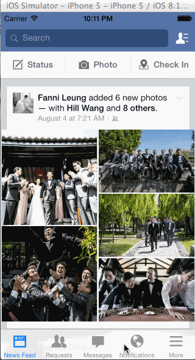

Facebook_Homework
=================

This app shows the Facebook Feed and allows the user to click into a set of 5 wedding photos. When clicked, the photos zoom up.

Total time: 12 hours

* [x] Tapping on a photo in the news feed should expand the photo full screen.
* [x] Tapping the Done button should animate the photo back into its position in the news feed.
* [x] On scroll of the full screen photo, the background should start to become transparent, revealing the feed.
* [x] If the user scrolls a large amount and releases, the full screen photo should dismiss.

GIF created with [LiceCap](http://www.cockos.com/licecap/).
